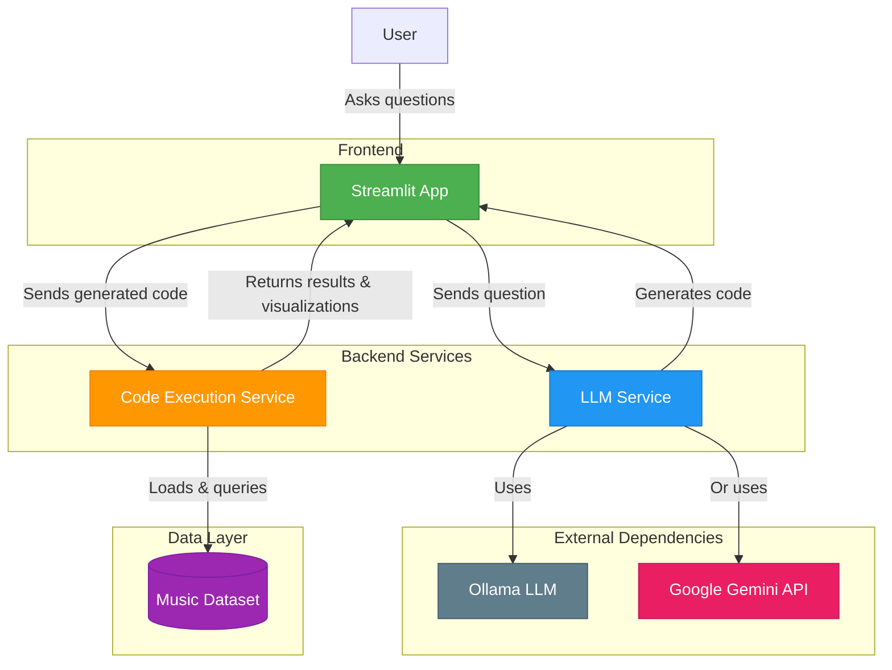

# Architecture Overview

This document provides an overview of the Music AI Assistant architecture, explaining how the different components interact with each other.

## System Architecture

## Component Interaction Flow

1. **User Interaction**:
   - User submits a natural language question about music data through the Streamlit web interface

2. **Code Generation**:
   - Streamlit app sends the question to the LLM Service
   - LLM Service uses either Gemini or Gemma (via Ollama) to generate Python code that answers the question
   - Generated code is returned to the Streamlit app

3. **Code Execution**:
   - Streamlit app sends the generated code to the Code Execution Service
   - Code Execution Service safely executes the code in a restricted environment
   - Code accesses the pre-loaded music dataset to perform analysis
   - Results and visualizations are returned to the Streamlit app

4. **Result Presentation**:
   - Streamlit app displays the results, visualizations, and explanations to the user

## Communication Protocols

- All inter-service communication uses HTTP/JSON
- The Streamlit app connects to services using environment variables:
  - `LLM_SERVICE_URL` (default: http://localhost:8081)
  - `CODE_EXECUTION_SERVICE_URL` (default: http://localhost:8082)

## Containerization

Each component runs in its own Docker container:
- `streamlit-app`: The frontend Streamlit application
- `llm-service`: The code generation service
- `code-execution-service`: The service that safely executes generated code

These containers are orchestrated using Docker Compose, with a shared network allowing them to communicate with each other.
